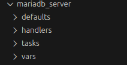

# ansible_exam
## Final project for the MOV24 course

This project will be about ansible and how it works.
Setup in this project will be 
1 Manager vm. Ubuntu OS desktop version. From here ansible will manage other hosts
1 Ubuntu 24.04 server
2 Debian 13 server

1 Ubuntu server will be a web-server
1 debian will handle docker and application like IT-Tools
1 debian will become an SQL DB


Ansible is an agentless automation tool that you install on a single host.
Example is that you install it on you desktop or a dedicated server for it and it can be installed simply with very few commands or step.
For Ubuntu all that is needed for it to be installed is running command to update packaged first and than running the install command:
```bash
# update package manager
apt update

# install ansible
apt install ansible
```
More ways to install ansible:
[ansible installation guide](https://docs.ansible.com/projects/ansible/latest/installation_guide/intro_installation.html#managed-node-requirements)

Thats it its now installed

Ansible uses SSH for connection and to manage hosts. No agents needs to be installed.
Its just important to know that the host has ssh enabled and that ansible has the passwrod or ssh-key for the host.
My way to run this is to have ready template to create/install my hosts.
Example is that Debian and Ubuntu are installed with a template on this example, proxmox.
The template kickstarts a virtuall machine with wanted OS, user name, ssh-key and so on. so these machine are empty but has all the needed credentials added. Easy and fast to get up and running for work tasks.


Ansible in writen in python codes. But for setting up playbook and etc (will be seen later in the README ) YAML code is used.
templates and variables are connected/written in jinja2.
when ansible talks to a host/module it uses JSON.but that ansible handles all itself.
Powershell is also used when it comes to windows system


#### GIT
GIT and github is used and is recommended so work dosent get lost. specialy when so much is in codes.
and good thing with ansible togheter with github. its simple to clone to another computer and puch the work from there or keep working on the codes from there.
some commands that i use alot
```
git pull
git status
git add
git commit -m "info"
git push
gitignore
```


### Structure

This is the structure that will be setup

```bash
ansible_exam/
├── ansible.cfg
├── inventory
├── playbooks/
│   ├── site.yml
│   ├── web.yml
│   └── docker.yml
├── group_vars/
│   ├── all.yml 
│   ├── db.yml         
│   ├── debian.yml
│   ├── web.yml 
│   └── ubuntu.yml       
├── host_vars/
│   ├── debian1.yml
│   └── ubuntu1.yml
└── roles/
    ├── mariadb_server/
    ├── defaults/
    │   └── main.yml
    ├── vars/
    │   └── main.yml
    ├── tasks/
    │   └── main.yml
    ├── handlers/
    │   └── main.yml
    │       
    ├── apache_php/
    │   ├── tasks/
    │   │   └── main.yml
    │   ├── templates/
    │   │   └── index.html.j2
    │   ├── files/
    │   ├── handlers/
    │   │   └── main.yml
    │   ├── vars/
    │   │   └── main.yml
    │   └── defaults/
    │       └── main.yml
    │
    └── docker_host/
        └── tasks/
            └── main.yml
```


###
Gotta make sure you are in the right map
```
mkdir -p ~/ansible_exam/

cd ~/path/ansible_exam/
```
This will be ground zero from where the work will be done.


### ansible.cfg

#### creating the ansible configuration file
ansible.cfg is config file which holds the main settings for ansible to use.
It makes commands easier and smaller, but when and if wanted there are commands thats can owerwrite with other configs

```
nano ansible.cfg
```
writing and adding wanted config for ansbile to use.
```
[defaults]
inventory = inventory

remote_user = tom
private_key_file = ~/.ssh/id_ed25519


host_key_checking = False      
retry_files_enabled = False    # don't create *.retry files
stdout_callback = yaml         # Newer output than the olrd standard
interpreter_python = auto_silent

forks = 10                     # how many hosts to let ansible connect at once
timeout = 15                   # SSH timeout, ansible will try for this amount of time before giving up or going to the next one

roles_path = ./roles           # where your roles live
log_path = ./ansible.log       # log everything here

[privilege_escalation]
become = True
become_method = sudo
become_ask_pass = False        # no sudo password. your user must have NOPASSWD. Very good with templates that has done this before use


```

config DONE


### inventory

inventory is where we store hosts.
so debian and ubuntu hosts will be added here.
either DNS name or IP can be added
Ansible will find them here when needed.

##### creating inventory file
cd ~/path/ansible_exam

```
nano inventory

# add

[debian]
10.8.0.91
10.8.0.92


[ubuntu]
10.8.0.81


[db]


[webserver]

``` 

If hosts are added connection can be tested with
```
ansible all -m ping
```
output should be something like:
```
10.8.0.81 | SUCCESS => {
    "ansible_facts": {
        "discovered_interpreter_python": "/usr/bin/python3"
    },
    "changed": false,
    "ping": "pong"
}
```

inventory DONE


### playbooks

Playbook
This is where jobs are added.
like check for hosts if they are online, do security updates or maybe install something.
Its important to have --- in the beginning of an yaml in ansible

### Creating playbooks
```
cd ~/path/ansible_exam
mkdir playbooks
```
```
nano playbooks/base.yml
```
In the file a simple playbook with actions that will:
Test connections
Update the package and security updates

### base.yml
yaml file will include jobs like:
test connection
updates package store
upgrade distro/security packages
install some tolls if wanted like curl,git,tmux etc

```yaml
---
- name: Base setup and update on all servers
  hosts: all
  become: true

  tasks:
    - name: Test connection with ping
      ansible.builtin.ping:
      tags: [always]

    - name: Update apt cache (Debian/Ubuntu)
      ansible.builtin.apt:
        update_cache: yes
        cache_valid_time: 3600
      when: ansible_os_family == "Debian"
      tags: [apt]

    - name: Upgrade all packages to latest version (Debian/Ubuntu)
      ansible.builtin.apt:
        upgrade: dist
      when: ansible_os_family == "Debian"
      tags: [apt, upgrade]


    - name: Install some base tools (Debian/Ubuntu)
      ansible.builtin.apt:
        name:
          - htop
          - curl
          - git
        state: present
      when: ansible_os_family == "Debian"
      tags: [tools]

```
To run
```bash
# Run the whole playbook
ansible-playbook playbooks/base.yml

# Run certain tag's
ansible-playbook playbooks/base.yml --tags apt

```

### web.yml

#### variables


some variable can be used here if wanted
```
cd ~/path/ansible_exam

mkdir group_vars

nano group_vars/web.yml

# add or write wanted variables

web_document_root: /var/www/html
web_index_url: "https://raw.githubusercontent.com/exam-mov24/simple_index.html_files/refs/heads/main/index.html"
# web_index_url: "https://raw.githubusercontent.com/YOURUSER/YOURREPO/main/index.html"
# web_index_url: "https://raw.githubusercontent.com/YOURUSER/YOURREPO/main/index.html"


```


#### creating web.yml

```
nano playbooks/web.yml
```
web.yml will be a playbook that handle the action to prepare and create wanted web-server
this file will:
update package store, we need the latest packages for Apache and php
install apache and php
make sure apache in enabled/active
depending how index.html is wanted. it can be copied or downloaded from something like github
it will end with restarting Apache and site should be ready to use

```yaml
---
- name: Web server setup Apache, PHP, index.html
  hosts: web
  become: true
  
  # if run with group_vars/web.yml remove the next 3 lines "vars"
  vars:
    web_document_root: "/var/www/html" 
    web_index_url: "https://raw.githubusercontent.com/exam-mov24/simple_index.html_files/refs/heads/main/index3.html"


  tasks:
    - name: Ensure apt cache is updated (Debian/Ubuntu)
      ansible.builtin.apt:
        update_cache: yes
        cache_valid_time: 3600
      when: ansible_os_family == "Debian"
      tags: [apt]

    - name: Install Apache and PHP packages (Debian/Ubuntu)
      ansible.builtin.apt:
        name:
          - apache2
          - libapache2-mod-php
          - php
        state: present
      when: ansible_os_family == "Debian"
      tags: [apache, php]

    - name: Ensure Apache is enabled and running
      ansible.builtin.service:
        name: apache2
        enabled: true
        state: started
      when: ansible_os_family == "Debian"
      tags: [apache]

    - name: Download index.html from GitHub
      ansible.builtin.get_url:
        url: "{{ web_index_url }}"
        dest: "{{ web_document_root }}/index.html"
        mode: "0644"
        owner: root
        group: root
      when: ansible_os_family == "Debian"
      notify: restart apache
      tags: [content, index]

  handlers:
    - name: restart apache
      ansible.builtin.service:
        name: apache2
        state: restarted
      when: ansible_os_family == "Debian"

```

To run
```bash
# to run the whole playbook
ansible-playbook playbooks/web.yml

# Only refresh index.html content
ansible-playbook playbooks/web.yml --tags content

```


web.yml DONE


### Docker playbook

This playbook will contain the part with installing docker and installing an application with  docker.

Also here preparation for variables can be used.

```bash
cd ~/path/ansible_exam
```

create variable file
```bash
nano group_vars/docker.yml
```
```yaml
docker_users:
  - YOURUSER
# will be added to docker group on docker hosts

# These are not needed to be used if not wanted
docker_deploy_it_tools: true
docker_it_tools_port: "8080"
# host port http://server:8080

```


#### docker.yml

Creating the playbook
It will contain:
updating package index
installing docker engine and the tolls it might need like python3
checking that enablade
Adding wanted user to docker group
and in the end  IT-tools will be installed.


```bash
cd ~/path/ansible_exam
nano playbooks/docker.yml

```

```yaml

---
- name: Docker host setup
  hosts: docker
  become: true

  tasks:
    - name: Ensure apt cache is updated (Debian/Ubuntu)
      ansible.builtin.apt:
        update_cache: yes
        cache_valid_time: 3600
      when: ansible_os_family == "Debian"
      tags: [apt]

    - name: Install Docker engine and tools (Debian/Ubuntu)
      ansible.builtin.apt:
        name:
          - docker.io
#          - docker-compose-plugin
          - python3-docker
        state: present
      when: ansible_os_family == "Debian"
      tags: [docker]

    - name: Ensure docker service is enabled and running
      ansible.builtin.service:
        name: docker
        enabled: true
        state: started
      tags: [docker]

    - name: Add users to docker group
      ansible.builtin.user:
        name: "{{ item }}"
        groups: docker
        append: true
      loop: "{{ docker_users | default([]) }}"
      when: docker_users is defined
      tags: [docker, users]

    - name: Ensure it-tools container is running
      community.docker.docker_container:
        name: it-tools
        image: ghcr.io/corentinth/it-tools:latest
        restart_policy: unless-stopped
        ports:
          - "{{ docker_it_tools_port }}:80"
      when:
        - docker_deploy_it_tools | default(false)
      tags: [containers, it_tools]

```

to run playbook:
```bash
# Run the whole book
ansible-playbook playbooks/docker.yml

# Run with tag's
ansible-playbook playbooks/docker.yml --tags it_tools 

```
from example above, application like It-Tools should be available from: http:hostIP:8080


docker.yml DONE


#### some info
Now everything above works.
but to make it easier and little mor felxibel more variable maps will be made.
Its good to know that vars overwrite whats on the playbooks, if they have something in them.


#### Fixing vars
These are not needed but good and fun to have.


```
├── group_vars/
│   ├── all.yml          
│   ├── debian.yml
│   ├── web.yml 
│   └── ubuntu.yml       
├── host_vars/
│   ├── debian1.yml
│   └── ubuntu1.yml
```

#### all.yml  vars
These variables will be effected on all playbooks unless its not wanted.

```bash
nano group_vars/all.yml
```
add wanted vars.
```yaml
---
# How long apt metadata is considered fresh (seconds)
apt_cache_valid_time: 3600

# Base packages you want everywhere
common_packages:
  - htop
  - curl
  - vim
```


#### debian.yml  vars
variables that are specific for [debian] group

```bash
nano group_vars/debian.yml
```
add wanted vars

```yaml
---
# Debian-specific settings
debian_motd: "Managed by Ansible (Debian group)"

```

#### ubuntu.yml vars

```bash
nano group_vars/ubuntu.yml
```

add wanted vars:

```yaml
---
ubuntu_motd: "Managed by Ansible (Ubuntu group)"

```


### Roles

Roles can be used to pack everything that is needed for a certaing thing in one place
one clean folder to do the job for a certaing task. like getting a web-server up and running with more wanted config and settings.
Also good to have when a library grows and the structure will look better and have an easier readability

#### Creating first role:
This role will handle web-server and make it host an web-site
```bash
# where to be
cd ~/path/ansible_exam

# Create needed dir
mkdir -p roles/apache_php/tasks
mkdir -p roles/apache_php/handlers
mkdir -p roles/apache_php/templates
mkdir -p roles/apache_php/defaults
mkdir -p roles/apache_php/vars
mkdir -p roles/apache_php/files
# create needed yml files or more like wanted yml files
nano roles/apache_php/tasks/main.yml
nano roles/apache_php/handlers/main.yml
nano roles/apache_php/templates/index.html.j2
nano roles/apache_php/defaults/main.yml
nano roles/apache_php/vars/main.yml
```

what to add in each yml file
```
nano roles/apache_php/tasks/main.yml
```
```yml
---
- name: check if apt cache is updated
  ansible.builtin.apt:
    update_cache: yes
    cache_valid_time: "{{ apt_cache_valid_time | default(3600) }}"
  when: ansible_os_family == "Debian"
  tags: [apt, apache_php]

- name: Install Apache and PHP packages
  ansible.builtin.apt:
    name: "{{ apache_packages }}"
    state: present
  when: ansible_os_family == "Debian"
  tags: [apache, php, apache_php]

- name: Check if Apache service is enabled and running
  ansible.builtin.service:
    name: "{{ apache_service_name }}"
    enabled: true
    state: started
  when: ansible_os_family == "Debian"
  tags: [apache, apache_php]

- name: Deploy index.html from template
  ansible.builtin.template:
    src: "{{ web_index_template }}"
    dest: "{{ web_document_root }}/index.html"
    owner: root
    group: root
    mode: "0644"
  when: ansible_os_family == "Debian"
  notify: restart apache
  tags: [content, index, apache_php]

```

```
nano roles/apache_php/handlers/main.yml
```
```yaml
---
- name: restart apache
  ansible.builtin.service:
    name: "{{ apache_service_name }}"
    state: restarted

```

```
nano roles/apache_php/templates/index.html.j2
```
```yaml
<!DOCTYPE html>
<html lang="en">
<head>
  <meta charset="UTF-8">
  <title>{{ web_page_title }}</title>
  <style>
    body {
      margin: 0;
      height: 100vh;
      display: flex;
      align-items: center;
      justify-content: center;
      font-family: Arial, sans-serif;
      background: linear-gradient(135deg, #204060, #5070c0);
      color: #f5f5f5;
      overflow: hidden;
    }

    .box {
      text-align: center;
      position: relative;
      z-index: 2; /* above the snow */
    }

    h1 {
      font-size: 3rem;
      margin-bottom: 0.5rem;
    }

    p {
      font-size: 1.2rem;
      opacity: 0.9;
    }

    small {
      display: block;
      margin-top: 1rem;
      opacity: 0.7;
      font-size: 0.9rem;
    }

    /* Snow layer */
    .snow {
      position: fixed;
      top: 0;
      left: 0;
      width: 100vw;
      height: 100vh;
      pointer-events: none;
      overflow: hidden;
      z-index: 1;
    }

    .snowflake {
      position: absolute;
      top: -10px;
      width: 6px;
      height: 6px;
      background: rgba(255, 255, 255, 0.9);
      border-radius: 50%;
      box-shadow: 0 0 6px rgba(255, 255, 255, 0.8);
      animation-name: snow-fall;
      animation-timing-function: linear;
      animation-iteration-count: infinite;
    }

    @keyframes snow-fall {
      0% {
        transform: translate3d(0, -10px, 0);
        opacity: 0;
      }
      10% {
        opacity: 1;
      }
      100% {
        transform: translate3d(20px, 110vh, 0);
        opacity: 0;
      }
    }
  </style>
</head>
<body>
  <!-- Snow overlay -->
  <div class="snow">
    <div class="snowflake" style="left: 5%;  animation-duration: 10s; animation-delay: 0s;"></div>
    <div class="snowflake" style="left: 15%; animation-duration: 12s; animation-delay: -2s;"></div>
    <div class="snowflake" style="left: 25%; animation-duration: 9s;  animation-delay: -4s;"></div>
    <div class="snowflake" style="left: 35%; animation-duration: 11s; animation-delay: -1s;"></div>
    <div class="snowflake" style="left: 45%; animation-duration: 13s; animation-delay: -3s;"></div>
    <div class="snowflake" style="left: 55%; animation-duration: 10s; animation-delay: -5s;"></div>
    <div class="snowflake" style="left: 65%; animation-duration: 14s; animation-delay: -6s;"></div>
    <div class="snowflake" style="left: 75%; animation-duration: 9s;  animation-delay: -7s;"></div>
    <div class="snowflake" style="left: 85%; animation-duration: 12s; animation-delay: -8s;"></div>
    <div class="snowflake" style="left: 95%; animation-duration: 11s; animation-delay: -9s;"></div>

    <div class="snowflake" style="left: 10%; animation-duration: 16s; animation-delay: -3s;"></div>
    <div class="snowflake" style="left: 20%; animation-duration: 15s; animation-delay: -6s;"></div>
    <div class="snowflake" style="left: 30%; animation-duration: 17s; animation-delay: -1s;"></div>
    <div class="snowflake" style="left: 40%; animation-duration: 13s; animation-delay: -4s;"></div>
    <div class="snowflake" style="left: 50%; animation-duration: 18s; animation-delay: -2s;"></div>
    <div class="snowflake" style="left: 60%; animation-duration: 14s; animation-delay: -7s;"></div>
    <div class="snowflake" style="left: 70%; animation-duration: 19s; animation-delay: -5s;"></div>
    <div class="snowflake" style="left: 80%; animation-duration: 16s; animation-delay: -8s;"></div>
    <div class="snowflake" style="left: 90%; animation-duration: 15s; animation-delay: -9s;"></div>
  </div>

  <div class="box">
    <h1>{{ web_page_title }}</h1>
    <p>{{ web_page_message }}</p>
    <small>
      Host: {{ inventory_hostname }}
       ({{ host_display_name }})
      – OS: {{ ansible_distribution }} {{ ansible_distribution_version }}
    </small>
  </div>
</body>
</html>


```

```
nano roles/apache_php/defaults/main.yml
```
```yaml
---
web_document_root: /var/www/html
web_index_template: "index.html.j2"

web_page_title: "Ansible Web Server"
web_page_message: "This page was deployed by the apache_php role."

apache_packages:
  - apache2
  - libapache2-mod-php
  - php

```

```
---
nano roles/apache_php/vars/main.yml
```
```yaml
apache_service_name: "apache2"

```

Now that role book is ready another playbook alot simplier one can be made. with nless info in it.
```bash
nano playbook/role_web.yml
```
add:
```yaml
---
- name: Web server setup with apache_php role
  hosts: web
  become: true

  roles:
    - apache_php


```
That is all that is needed for the same playbook that earlier created a web page.
to run it:
```bash
ansible-playbook playbook/role_web.yml
```
from the hosts in inventory under web, is now hosting web-page on
http://hostIP


```bash
# docker host
mkdir -p roles/docker_host/tasks
nano roles/docker_host/tasks/main.yml
```
add:
```yaml
---
- name: Ensure apt cache is updated
  ansible.builtin.apt:
    update_cache: yes
    cache_valid_time: "{{ apt_cache_valid_time | default(3600) }}"
  when: ansible_os_family == "Debian"
  tags: [apt, docker_host]

- name: Install Docker engine and tools
  ansible.builtin.apt:
    name:
      - docker.io
      - docker-compose-plugin
      - python3-docker
    state: present
  when: ansible_os_family == "Debian"
  tags: [docker, docker_host]

- name: Check that docker service is enabled and running
  ansible.builtin.service:
    name: docker
    enabled: true
    state: started
  tags: [docker, docker_host]

- name: Add users to docker group
  ansible.builtin.user:
    name: "{{ item }}"
    groups: docker
    append: true
  loop: "{{ docker_users | default([]) }}"
  when: docker_users is defined
  tags: [docker, users, docker_host]

- name: Install and check that it-tools container is running
  community.docker.docker_container:
    name: it-tools
    image: ghcr.io/corentinth/it-tools:latest
    restart_policy: unless-stopped
    ports:
      - "{{ docker_it_tools_port | default('8080') }}:80"
  when:
    - docker_deploy_it_tools | default(false)
  tags: [containers, it_tools, docker_host]

```
And a new playbook
```bash
cd  ~/ansible_exam/
nano ansible_exam/playbooks/role_docker.yml
```
```yaml
---
- name: Docker host setup with docker_host role
  hosts: docker
  become: true

  roles:
    - docker_host

```
This will do the same as docker.yml playbook but looks better
run:
```bash
ansible-playbook playbooks/role_docker.yml
```
site can now be reached:
http://vmip:8080


### MariaDB role

Next up is an role that will have verything it needs to install and setup an SQL DB. In this role it will be MariaDB

start.
```bash
cd ~/ansible_exam/
```
add vars
```bash
nano ~/ansible_exam/groub_vars/
```
add:
```yml
db_engine: mariadb

db_name: exam_24
db_user: exam_24
# Password access your db, it should be really strong
db_password: "DontworryBehappy"

# option 10.8.0.% or specific host IP
db_app_host: "10.8.0.86"

# listen:
# 127.0.0.1 = only local
# 0.0.0.0   = all interfaces. should not be left like this if it is in prod.
mariadb_bind_address: "0.0.0.0"

```


and now its time for roles.
here all the info about what is needed to be done will be.

Setup
```
roles/
└── mariadb_server/
    ├── defaults/
    │   └── main.yml
    ├── vars/
    │   └── main.yml
    ├── tasks/
    │   └── main.yml
    └── handlers/
        └── main.yml
```

new command that will create several path and dir att once
Just need to make sure you are in the right map where you want it to build from
```bash
mkdir -p roles/mariadb_server/{defaults,vars,tasks,handlers}
```
one click and those dir are created


next up in the yml files

#### mariadb_server/defaults/main.yml
Default is a fallback, its has less prio to be run than: group_vars db.yml
so if db.yml is not there, default will be run and config from it used.

```bash
nano roles/mariadb_server/defaults/main.yml
```
add
```yml
---
db_engine: mariadb

db_name: exam_24
db_user: exam_24
db_password: "SuperSecret123"
db_app_host: "%"

mariadb_bind_address: "0.0.0.0"
mariadb_root_socket: "/var/run/mysqld/mysqld.sock"

``` 

#### roles/mariadb_server/vars/main.yml
wanted packages here.
```bash
nano roles/mariadb_server/vars/main.yml
```
add
```yaml
---
mariadb_packages:
  - mariadb-server
  - mariadb-client
  - python3-pymysql

mariadb_service_name: "mariadb"
mariadb_config_file: "/etc/mysql/mariadb.conf.d/50-server.cnf"

```

##### roles/mariadb_server/tasks/main.yml
Here are the task tha is to be done and information are gathered from the other dir with variables.

```bash
nano roles/mariadb_server/tasks/main.yml
```
add
```yaml
---
- name: Ensure apt cache is updated
  ansible.builtin.apt:
    update_cache: yes
    cache_valid_time: "{{ apt_cache_valid_time | default(3600) }}"
  when: ansible_os_family == "Debian"
  tags: [apt, mariadb]

- name: Install MariaDB server and Python driver
  ansible.builtin.apt:
    name: "{{ mariadb_packages | default(['mariadb-server', 'mariadb-client', 'python3-pymysql']) }}"
    state: present
  when: ansible_os_family == "Debian"
  tags: [mariadb, packages]

- name: Ensure MariaDB service is enabled and running
  ansible.builtin.service:
    name: "{{ mariadb_service_name | default('mariadb') }}"
    enabled: true
    state: started
  tags: [mariadb, service]

- name: Configure MariaDB bind-address
  ansible.builtin.lineinfile:
    path: "{{ mariadb_config_file | default('/etc/mysql/mariadb.conf.d/50-server.cnf') }}"
    regexp: '^bind-address'
    line: "bind-address = {{ mariadb_bind_address }}"
    backup: yes
  notify: restart mariadb
  tags: [mariadb, config]

- name: Ensure application database exists
  community.mysql.mysql_db:
    name: "{{ db_name }}"
    state: present
    login_unix_socket: "{{ mariadb_root_socket | default('/var/run/mysqld/mysqld.sock') }}"
  tags: [mariadb, db]

- name: Ensure application DB user exists with privileges
  community.mysql.mysql_user:
    name: "{{ db_user }}"
    password: "{{ db_password }}"
    host: "{{ db_app_host }}"
    priv: "{{ db_name }}.*:ALL"
    state: present
    login_unix_socket: "{{ mariadb_root_socket | default('/var/run/mysqld/mysqld.sock') }}"
  tags: [mariadb, user]

```


#### roles/mariadb_server/handlers/main.yml

```bash
nano roles/mariadb_server/handlers/main.yml
```

add
```yml
---
- name: restart mariadb
  ansible.builtin.service:
    name: "{{ mariadb_service_name | default('mariadb') }}"
    state: restarted
```

Now the role book is done
All that is needed now is playbook for it so ansible can run it later

Create playbook:
```bash
nano playbooks/role_db.yml
```
add
```yml
---
- name: MariaDB server setup
  hosts: db
  become: true

  roles:
    - mariadb_server


```

Now its ready to be run.
Add wanted hosts ip or dns to [db]
Run the book
```bash
ansible-playbook playbooks/role_db.yml
``` 
check from terminal if it is upp and running
```bash
mysql -h 10.8.0.x -u exam_24 -p exam_24
```

